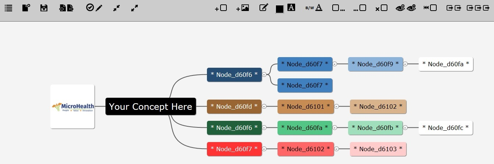

#MHMind

The MHMind app uses jsMind, a JavaScript version of mind mapping.

https://github.com/hizzgdev/jsmind 
https://github.com/MicroHealthLLC/MHMind/README_jsMind.md 
https://github.com/MicroHealthLLC/MHMind/LICENSE_jsMind.md

<h4>Instructions</h4>
<ol>
<li>Download app from https://github.com/MicroHealthLLC/MHMind</li>
<li>Unzip and place in desired location</li>
<li>Open a browser and drag index.html onto the window</li>
</ol>

